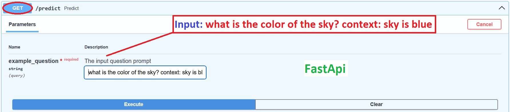
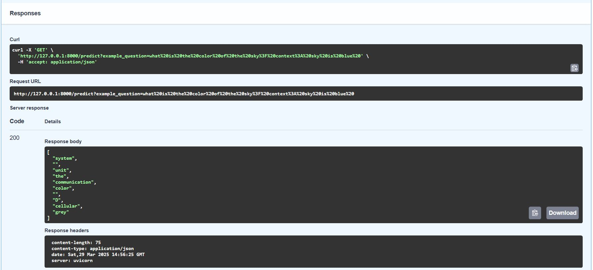
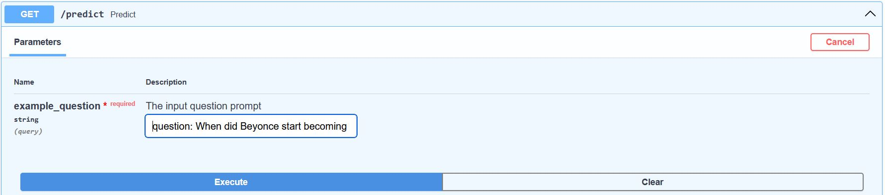
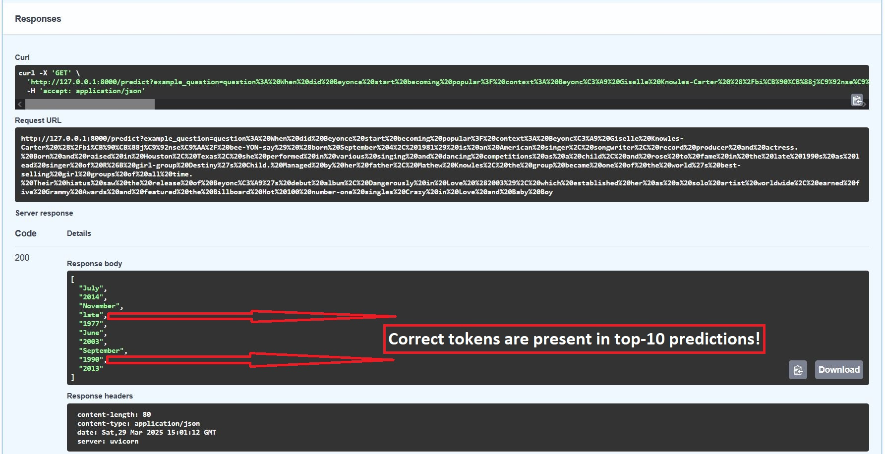

Note:

This version of the project works well if you expect around a thousand viewers per week.
But it is **not designed to scale** beyond that.

If you want a highly scalable version, contact me at **[ansimran@protonmail.com](mailto:ansimran@protonmail.com)**.

The main goal here is to **showcase Machine Learning skills**, not full-stack AI development skills.

For an example of my work in full-stack AI development with scalability in mind, you can check this project:
👉 [Production-ready self-corrective RAG](https://github.com/AnsImran/production-ready-self-corrective-RAG).

---
# End-to-End NLP Project
**tags**: PyTorch, Pre-Training, Masked-Language-Modelling, Full-Fine-Tuning, Question-Answering. 

---
# PyTorch
## Pre-Training and Full Fine-Tuning of a Transformer
### Based on the [Natural Language Processing Specialization](https://www.deeplearning.ai/courses/natural-language-processing-specialization/) by DeepLearning.ai
#### Course 4 – Week 3  

📘 **Full NLP Specialization GitHub Repo here:** [Natural Language Processing from Scratch](https://github.com/AnsImran/natural_language_processing_from_scratch) 

---
## Deploying with FastAPI: Snapshots
### Unseen Data

### Training Data

---
# [Table of Contents](https://github.com/AnsImran/Pre-Training__and__Full_Fine-Tuning__of__a__Transformer/blob/main/02_Data_Processing_%26_Model_Training/Encoder-Decoder_Transformer_Pretraining_%2B_Full%20Fine%20Tuning.ipynb)

## **Pretraining Section-1**

### Dataprocessing for Pre-Training

 - #### Pre-Training Objective

 - #### C4 Dataset Description

 - #### Loading the Data

 - #### Processing C4 Dataset

   - ##### Loading Pretrained Tokenizer

   - ##### Masked Language Modelling

   - ##### Creating Input-Target pairs

## **Pretraining Section-2**

- #### Instantiating a New Transformer Model

- #### Setting up Dataloader

- #### Training Loop

## **Fine-Tuning Section-1**

### Data Processing for Fine-Tuning

- #### Data Loading - SQuAD 2.0 Dataset

- #### Data Parsing

## **Fine-Tuning Section-2**

- #### Setting up Dataloader

- #### Training Loop

- #### Inference

## **Conclusion & What's Next?**
---

