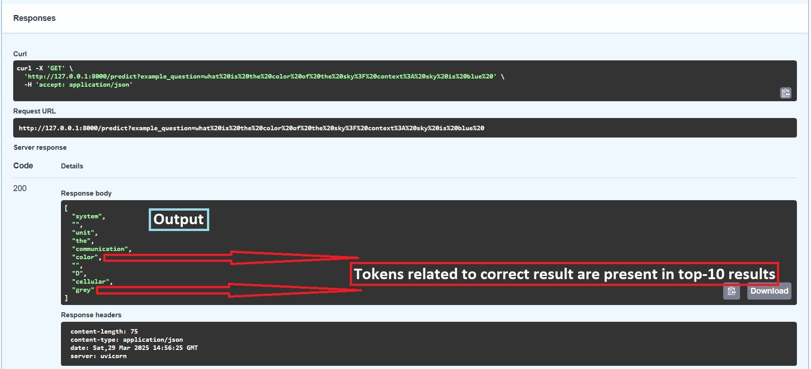
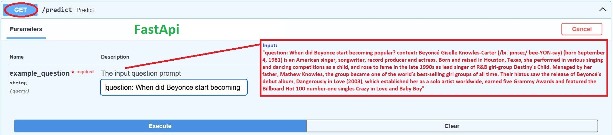
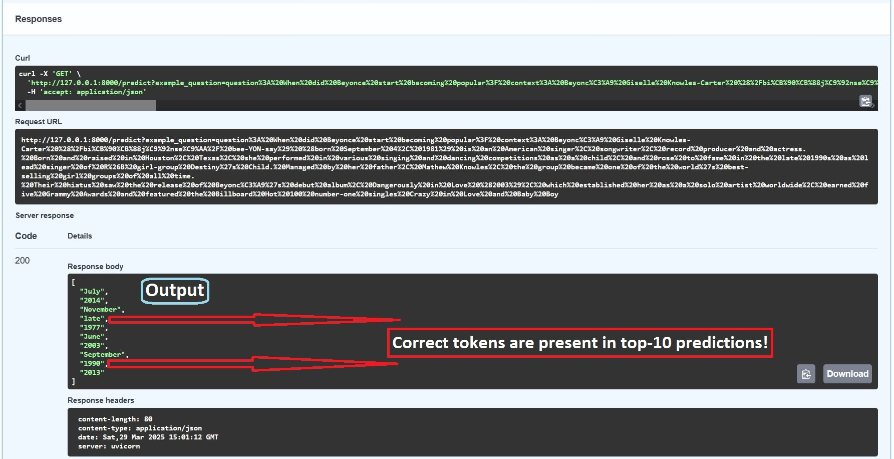

**tags**: PyTorch, numpy, pandas, Data Processing, Tokenization, Padding, Generator, Positional-Encoding, Padding-Mask, Look-Ahead-Mask, Encoder, Decoder, MultiHead-Self-Attention, Residual-Connectioncs, Batch Normalization, Feed-Forward-Neural-Networks, Embedding-Layer, Dropout-Layer, Masked-MultiHead-Self-Attention-(Causal-Attention), Linear-Layer, Log-Softmax, Training-Loop, Epochs, Learning Rate, Batch-Size, Pad-Index, Loss-Function, Optimizer, Predictions, Gradients & Updating Weights.

---
# PyTorch
## Pre-Training and Full Fine-Tuning of a Transformer
### Based on the [Natural Language Processing Specialization](https://www.deeplearning.ai/courses/natural-language-processing-specialization/) by DeepLearning.ai
#### Course 4 – Week 3  

📘 **Full NLP Specialization GitHub Repo Here:** [Natural Language Processing from Scratch](https://github.com/AnsImran/natural_language_processing_from_scratch) 

---
## Deploying with FastAPI: Snapshots
### Unseen Data

### Training Data

---
# [Table of Contents](https://github.com/AnsImran/Pre-Training__and__Full_Fine-Tuning__of__a__Transformer/blob/main/02_Data_Processing_%26_Model_Training/Encoder-Decoder_Transformer_Pretraining_%2B_Full%20Fine%20Tuning.ipynb)

## **Pretraining Section-1**

### Dataprocessing for Pre-Training

 - #### Pre-Training Objective

 - #### C4 Dataset Description

 - #### Loading the Data

 - #### Processing C4 Dataset

   - ##### Loading Pretrained Tokenizer

   - ##### Masked Language Modelling

   - ##### Creating Input-Target pairs

## **Pretraining Section-2**

- #### Instantiating a New Transformer Model

- #### Setting up Dataloader

- #### Training Loop

## **Fine-Tuning Section-1**

### Data Processing for Fine-Tuning

- #### Data Loading - SQuAD 2.0 Dataset

- #### Data Parsing

## **Fine-Tuning Section-2**

- #### Setting up Dataloader

- #### Training Loop

- #### Inference

## **Conclusion & What's Next?**
---

